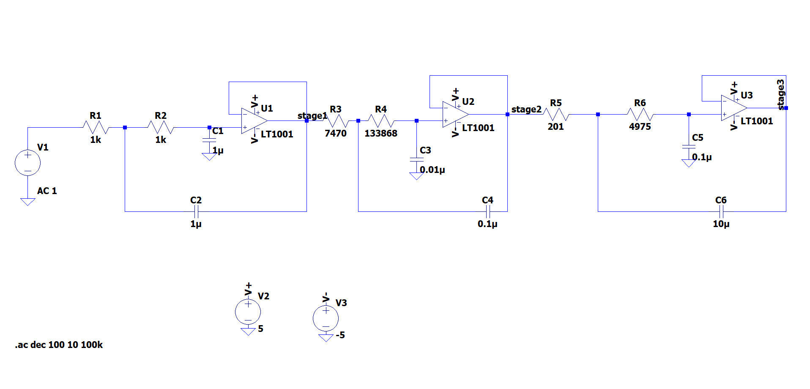
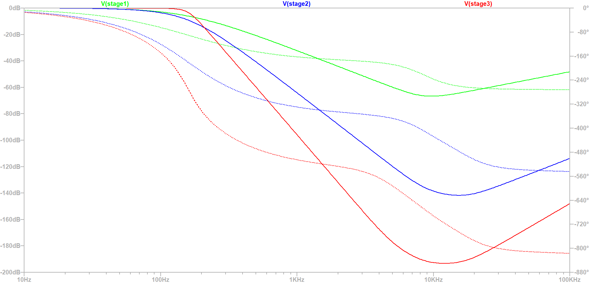
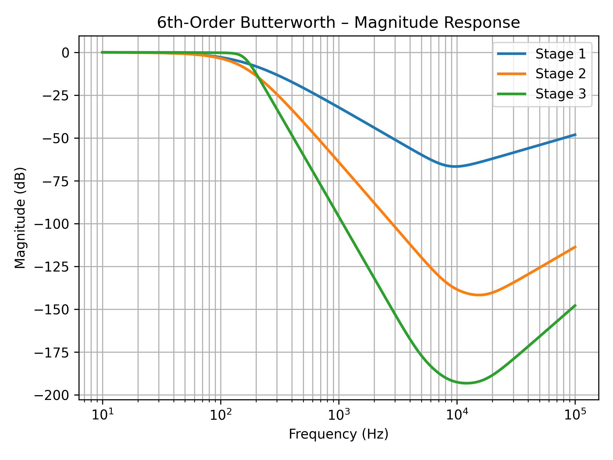
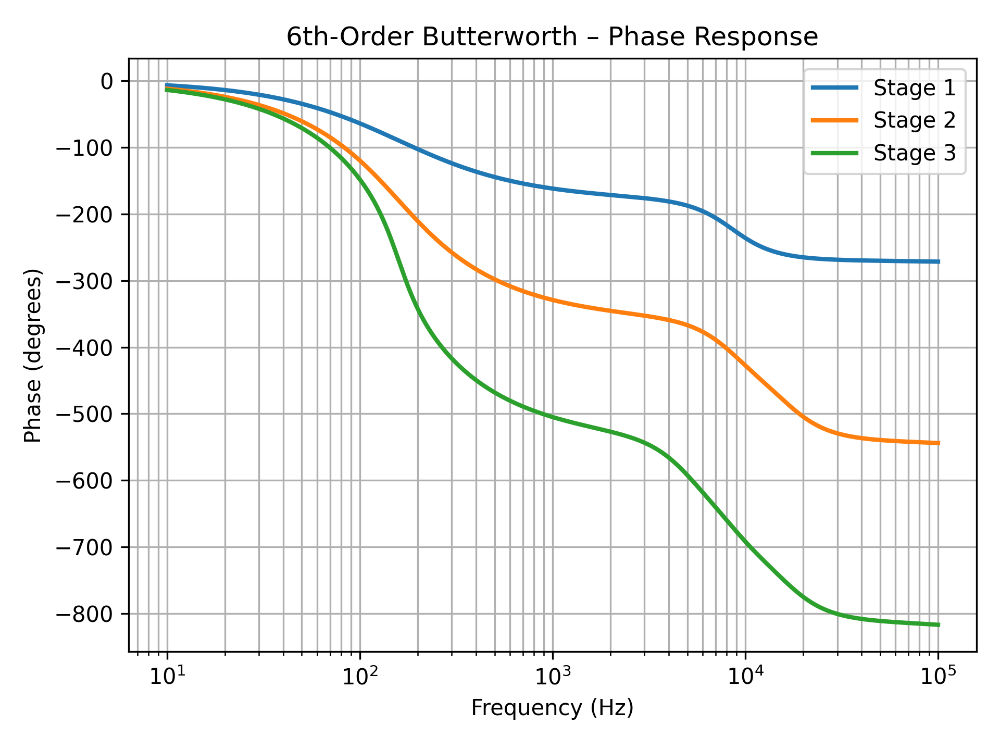

# butterworth-chebyshev-linux-automation

In most of my EE classes, I found the process of working with Bode plot data to be more tedious than it needed to be. The usual workflow involved exporting data from LTspice, manually cleaning up delimiters in Excel, moving the Excel file into MATLAB, and then running plotting scripts. This project replaces that process with a simple Linux-based automation that significantly reduces the number of manual steps.

---

## Filter designs used

The data used in this project comes from two analog filters I designed in LTspice:

- A 6th-order Butterworth low-pass filter
- A 6th-order Chebyshev low-pass filter

Both filters use the same cascaded 2nd-order active topology, with different RC values to achieve the desired frequency response. The designs were originally developed for my ECE 4205 course and are used here as example inputs for the automation flow.

Rather than focusing on synthesis math, this project focuses on analyzing and visualizing the frequency-domain behavior of implemented analog circuits.

---

## What this project does

This project demonstrates a Linux-based workflow for:

- Parsing LTspice AC sweep text exports
- Converting raw magnitude and phase data into a clean numeric CSV
- Generating Bode magnitude and phase plots directly using Python
- Correctly handling phase wrapping through unwrapping

The example data currently included is from a 6th-order Butterworth filter. The same workflow applies to Chebyshev designs using the same topology. The scripts are reusable for any LTspice AC sweep export with the same data format.

---

## Workflow

1. Run an AC sweep in LTspice
2. Export the waveform data as a text file and save it as:
   data.txt
3. Run the parsing script:
   python3 txt_csv.py
4. Run the plotting script:
   python3 plot.py
5. On Windows (WSL), generated images can be viewed from the project directory using the WSL filesystem, for example:
\\wsl.localhost\<distro-name>\home\<username>\<project-directory>
 

This process avoids manual editing in Excel and does not require MATLAB.

---

## Repository contents

data.txt  
Raw LTspice AC sweep export

data.csv  
Parsed, unit-free numeric frequency response data

txt_csv.py  
Script to parse LTspice text output into CSV format

plot.py  
Script to generate Bode magnitude and phase plots from the CSV

magnitude.png  
Generated magnitude Bode plot

phase.png  
Generated phase Bode plot

sixthbutterworth.asc
LTspice schematic

---

## Why I built this

During analog and power electronics courses, frequency response analysis is repeated constantly as component values are tuned. Manually reformatting data during each iteration slows that process down and introduces opportunities for error. This script removes several intermediate steps and makes the analysis repeatable, scriptable, and easier to scale as designs change.

---

## Tools used

LTspice  
Python (pandas, matplotlib)  
Linux / WSL

---

## Future extensions

- Direct Butterworth vs Chebyshev comparison on shared axes
- Automatic cutoff frequency and ripple measurement
- Batch processing of multiple LTspice exports
